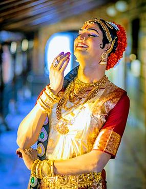

# Sanjay Vadapalli

Sanjay started learning Andhra Natyam and Perini at the young age of 8 from renowned Guru, Scholar and Musicologist, PadmaSri Dr. Nataraja Rama Krishna. Later he learned NavaJanardhana Parijatam,‟ one of the solo performing art traditions of Andhra Pradesh, under the able guidance of Guru Kala Krishna. Guru Dr. Nataraja Ramakrishna and Guru Kala Krishna have trained Sanjay so methodically taking care of the minutest details for over 5 years and made him a worthy exponent of Sathyabhama's role as depicted in the solo ballet “NavaJanardhanam‟ bringing out all the complex qualities of Sathyabhama.
A teacher‟s efforts bear fruit only in a worthy disciple. A worthy Guru and a worthy disciple are both blessed in each other. The team of Dr. Nataraja Rama Krishna and Sanjay is a fine example of this ideal combination. At age 9, Sanjay started performing in local functions and virtually walked into many dance lovers' hearts with his expressive mime and brilliant footwork. Soon he started performing in National events organized in Mumbai, New Delhi, Chennai, Bangalore, Kolkatta, and Benaras. His abhinaya as Sathyabhama fetched him a gold medal. He received accolades from Dr. Vempati Chinna Satyam, Kathak exponent Guru Birju Maharaj, Kathak queen Sitara Devi and other noted dance exponents. Recognizing his talent, Director K. Vishwanath offered in his film Srutilayalu.

​

 

Sanjay is considered one of the best Andhra Natyam dancers in the art circles. He was awarded many titles namely "Natya Kala Ratna" “Natya Kumara” Nrutya Kowmudhi” and National Integration Award. He is a certified “B” grade artist by Doordarshan. Sanjay has choreographed songs, dance drams and performed them in various events, festivals around the world including the USA, UK, and Hong Kong. Sanjay is currently based in Hong Kong and performs in the Hong Kong art circles and teaches to enthusiastic students.

Sanjay is working closely with Guru Kala Krishna to propagate Navajanardhana Parijatam to the next generations. Some of the planned activities include collecting, cataloging the 3 days songs, recording the audio and video of the songs. Another project Sanjay is working on is to establish a “Guru Nataraja Ramakrishna Pratibha puraskaram” for the upcoming performing artists. He performed in National events organized by AP Bhavan, New Delhi in 1988 and 1994.

### Awards, Honours, and Titles

Sanjay has won the below awards and honors.

```


1. Bharatiya KalaSree Sanman” by Indian Dance Association Bhubaneshwar, 2018

2. Nrutya Kowmudhi” Abhinaya Best Youth Classical Dancer 2012 award, Abhinaya Nrutya Bharati, Eluru

3. Natya Kumara” award given by Nataraja Music & Dance Academy, Vizag in 2012

4. National Integration Award” given by The Bombay Andhra Mahasabha & Gymkhana in 1989

5. Natya Kala Ratna” award given by Kala Bharathi, Nellore in 1988.

6. Appreciations from Kona Prabhakar Rao, Governor of Maharashtra in 1986, and Kumudben Joshi, Governor of Andhra Pradesh in 1989

7. Grade “B” artist by Doordarshan, India – 1989
```

### Major Performances in National & International Festivals


```


1. Performed at UNESCO PEACEMAKERS CULTURAL CELEBRATIONS held at Hong Kong #UNESCOHK in 2019

2. Choreographed and Performed Mana Telanganamu – dance play on Telangana literature and culture on the eve of World Telugu Literature held in Hyderabad 2017

3. Choreographed and Performed Sajeeva Nadulu – dance drama on rivers of Telugu land in ATA (American Telugu Association) Silver Jubilee celebrations, Chicago 2016

4. Performed in Abhinaya Youth Festival organized by Abhinaya Nrutya Bharati, Eluru - 2012

5. Performed in All India Male Dancers Festival organized by Nataraja Music & Dance Academy, Vizag in 2012

6. Performed in Thyagaraya Aaradhana Utsavams conducted by Vemulawada Rajarajeswara Temple authorities, Vemulawada in 2012 and 2013

7. Performed in State events organized by the Ministry of Cultural Affairs, Andhra Pradesh in 1989, 1991, and 1994.

8. Performed in National Integration event organized by The Bombay Andhra Mahasabha & Gymkhana in 1989

9. Performed in National Centre for Performing Arts (NCPA) in 1989

10.Performed in-state event organized by Ministry of Cultural Affairs, Tamilnadu in 1988

```
